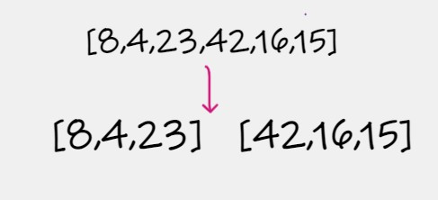
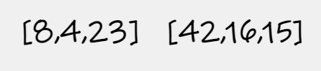
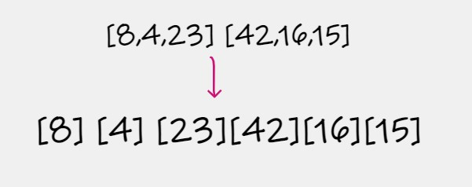
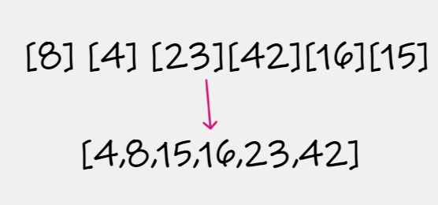

# MergeSort
- Write a function called  MergeSort.
- Review the pseudocode below, then trace the algorithm by stepping through the process with the provided sample array. 

# Pseudocode
       ALGORITHM Mergesort(arr)
        n <-- arr.length

    if n > 1
      DECLARE mid <-- n/2
      DECLARE left <-- arr[0...mid]
      DECLARE right <-- arr[mid...n]
      // sort the left side
      Mergesort(left)
      // sort the right side
      Mergesort(right)
      // merge the sorted left and right sides together
      Merge(left, right, arr)

          ALGORITHM Merge(left, right, arr)
       DECLARE i <-- 0
       DECLARE j <-- 0
        k <-- 0

      while i < left.length && j < right.length
        if left[i] <= right[j]
            arr[k] <-- left[i]
            i <-- i + 1
        else
            arr[k] <-- right[j]
            j <-- j + 1

        k <-- k + 1

      if i = left.length
       set remaining entries in arr to remaining values in right
       else
       set remaining entries in arr to remaining values in left

# Trace

## Sample Array: [8,4,23,42,16,15]
- step 1 :  divide the array into 2 halves to get a bunch of single-element arrays.

- step 2 : in this step still have the 2 halves of the array.

- step 3 :  split the array each element alone .

- step 4 : compare each element then merge the sorted array 

# Efficency
- Time Complexity : o(n+logn)
- Space Complexity : O(n)
