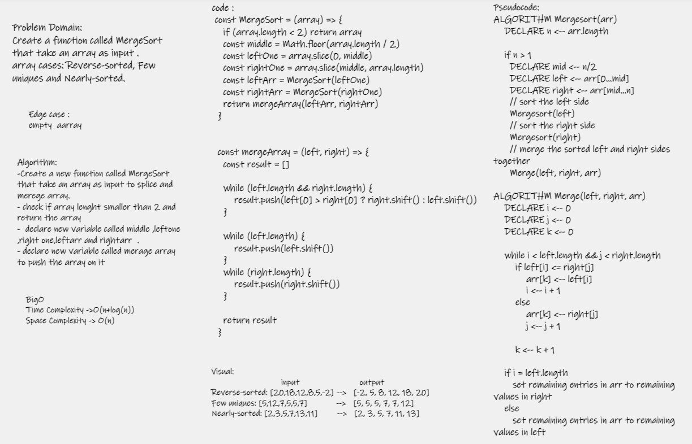

# Challenge Summary
-  Write a function called MergeSort.
- Review the pseudocode below, then trace the algorithm by stepping through the process with the provided sample array. 

## Whiteboard Process

## Approach & Efficiency
- Time Complexity : o(n+logn)
- Space Complexity : O(n)

## Solution

- Arguments: Array
- Return: list of all values in the array, in the order they were encountered
- use npm test .
