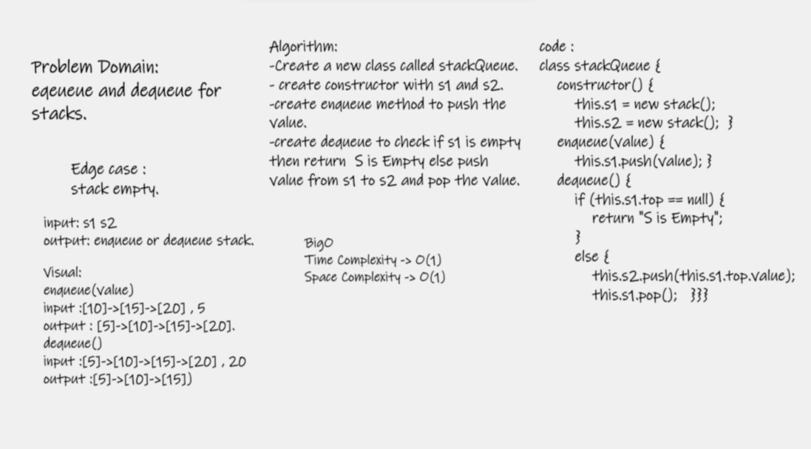

# Challenge Sammary
A queue method using two stacks

## Whiteboard Process
- stackQueue 

## Approach & Efficiency

- Time Complexity : o(1)
- Space Complexity : O(1)

## solution

- enqueue(value) which inserts value into the stackQueue, using FIFO approach.
- dequeue() which extracts a value from the stackQueue, using FIFO approach.

# Stack and a Queue

- A Stack is a linear data structure. that consists of Nodes. Each Node references 
the next Node in the stack, but does not reference its previous.
- A Queue is a linear data structure. It is an ordered list that follows the 
principle FIFO (First In -First Out). A Queue is a structure that follows some 
restrictions on insertion and deletion

# Challenge

-  Stack class : ( push,pop,peek,isEmpty) 
- Queue class : (enqueue,dequeue,peek,isEmpty) 

# Approach & Efficiency
- Stack: push(), pop(), peek(), isEmpty().
- Queue: enqueue(), dequeue(), peek(), isEmpty().

# API
- npm test to test the files (node.test.js , Queue.test.js and Stack.test.js ).

