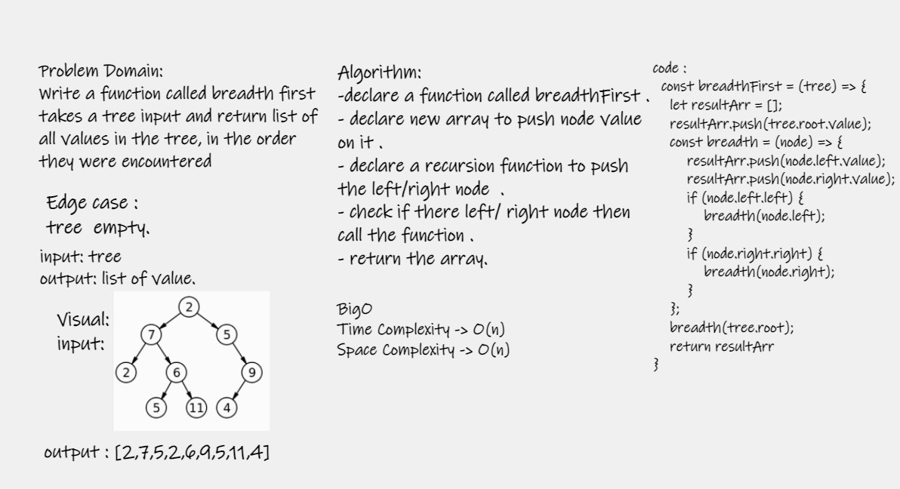

# Challenge Summary
-  Write a function called breadth first.

## Whiteboard Process

## Approach & Efficiency
- Time Complexity : o(n)
- Space Complexity : O(n)

## Solution

- Arguments: tree
- Return: list of all values in the tree, in the order they were encountered
- use npm test .