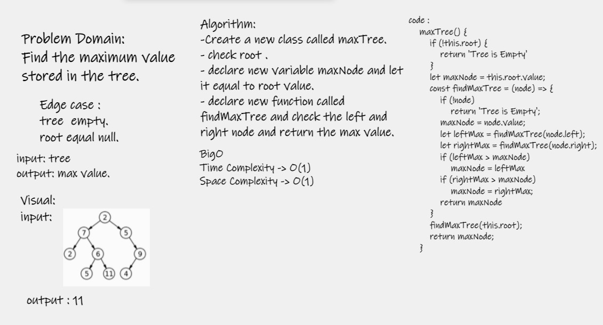

# Challenge Summary
- Find the maximum value stored in the tree.

## Whiteboard Process

## Approach & Efficiency
- Time Complexity : o(n)
- Space Complexity : O(1)

## Solution
- Write a function called maxTree
- Arguments: none
- Returns: number
- use npm test .