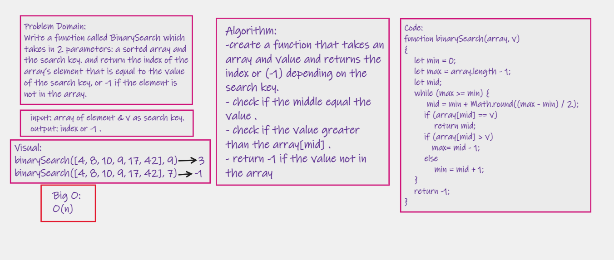

# Array Binary Search 
Write a function called BinarySearch which takes in 2 parameters: a sorted array and the search key and return the index of the array’s element that is equal to the value of the search key, or -1 if the element is not in the array.

## Whiteboard Process

## Approach & Efficiency

first get the min, max, and mid index of the given array.use a while loop to interate the array in half segments while the search key is not found.

