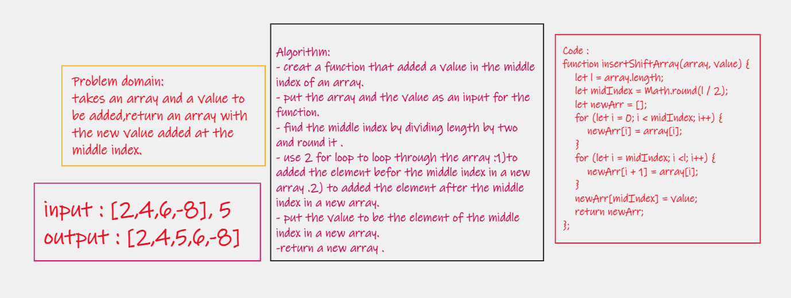

# Insert Shift Array  Function 
write a function that takes an array and value as input and return an array with the new value 
added at the middle index.
 
## Whiteboard Process

## Approach & Efficiency
- create a new array for insertShiftArray. 
- find the middle index,dividing length by two.
- loop through the array to get the elements before tme middle index.
- loop through the array to get the elements after tme middle index.
- put the value to be middle index element.
- return the new array.