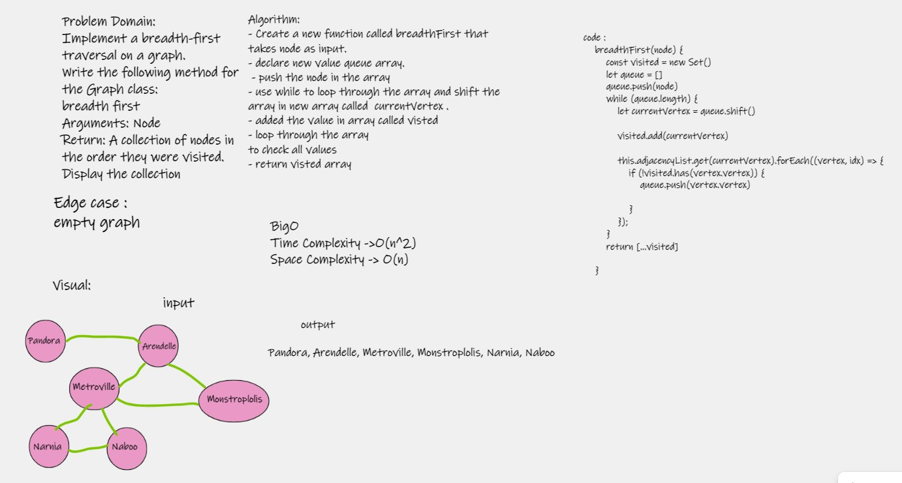

# Challenge Summary
- Implement a breadth-first traversal on a graph.

## Whiteboard Process

## Approach & Efficiency 
- Time Complexity : o(n^2) use more time to loop through the array .
- Space Complexity : O(n) use extray space for the result array .

## Solution

- breadth first
- Arguments: Node
- Return: A collection of nodes in the order they were visited.
- Display the collection