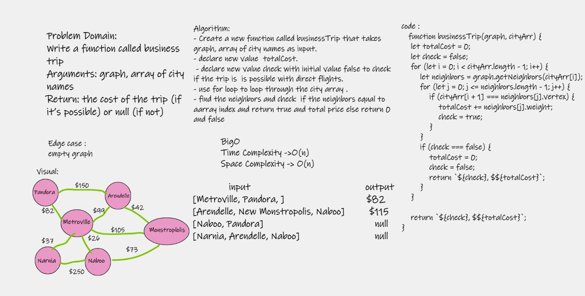

# Challenge Summary
- Write a function called business trip , Determine whether the trip is possible with direct flights, and how much it would cost..

## Whiteboard Process

## Approach & Efficiency 
- Time Complexity : o(n) use more time when we use 2 for loop in the function.
- Space Complexity : O(n) use extray space for the city array and neighbors array.

## Solution

- Write a function called business trip
- Arguments: graph, array of city names
- Return: the cost of the trip (if it’s possible) or null (if not)