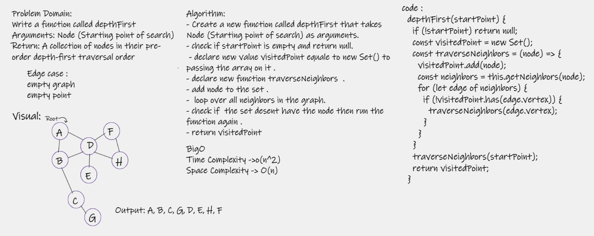

# Challenge Summary
- Conduct a depth first preorder traversal on a graph.

## Whiteboard Process

## Approach & Efficiency 
- Time Complexity : o(n^2) use more time to loop through the array .
- Space Complexity : O(n) use extray space for the result array .

## Solution

- Depth first
- Arguments: Node (Starting point of search)
- Return: A collection of nodes in their pre-order depth-first traversal order
- Program output: Display the collection