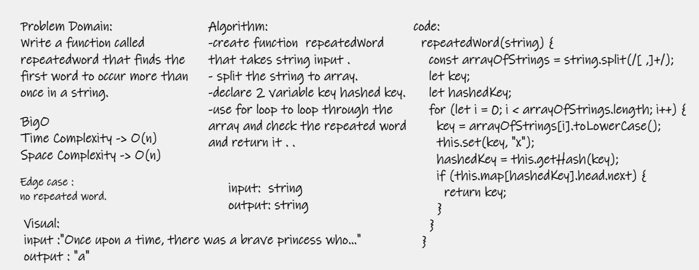

# Challenge Summary
- Write a function called repeatedword that finds the first word to occur more than once in a string

## Whiteboard Process

## Approach & Efficiency
- Time Complexity : o(n)
- Space Complexity : O(n)

## Solution

- Arguments: string
- Return: string
- use npm test .
