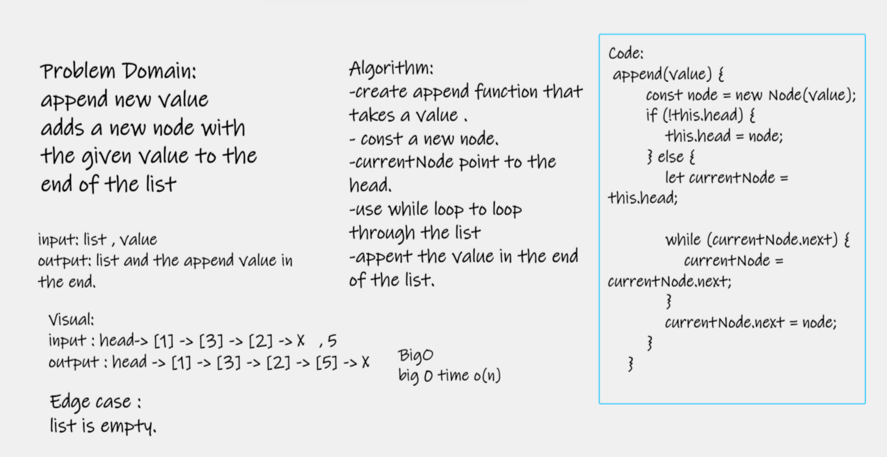
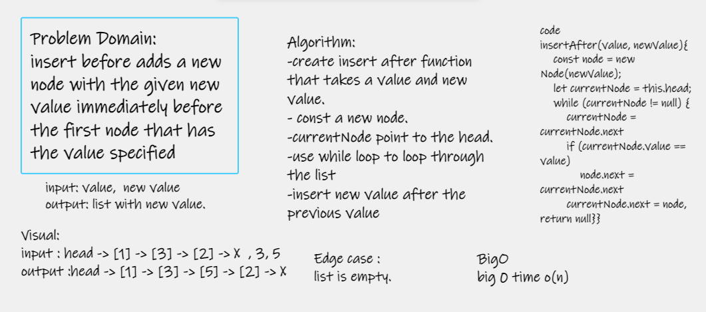
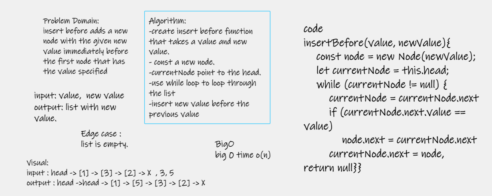

# Challenge Sammary
Linked list is linear data structures.which means that there is a sequence and an order to how they are 
constructed and traversed.
 
## Whiteboard Process
- Append 

- inserAfter 

- inserbefore 

## Approach & Efficiency
Time Complexity : append O(n) InsertBefore , O(n) InsertAfter, is O(n)

## solution
- append(value) which adds a new node with the given value to the end of the list
- insertBefore(value, newVal) which add a new node with the given newValue immediately before the first value node
- insertAfter(value, newVal) which add a new node with the given newValue immediately after the first value node
