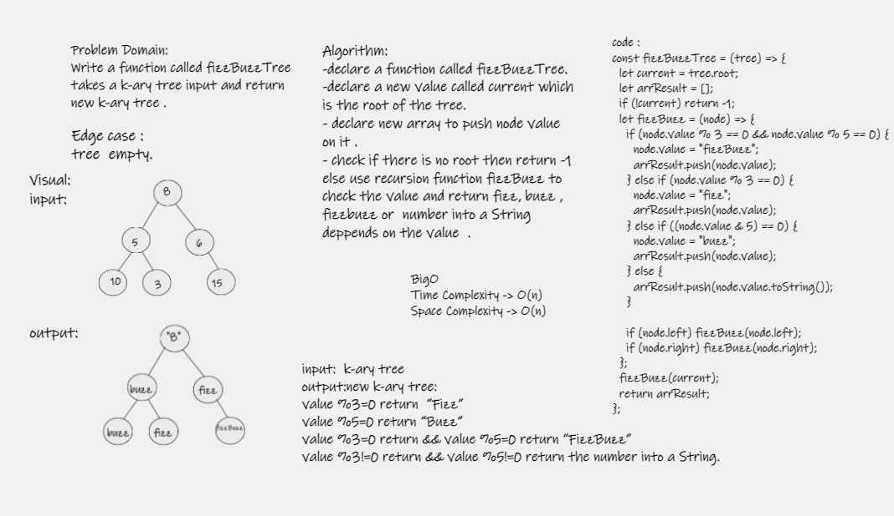

# Challenge Summary
-  Write a function called  fizzBuzzTree.

## Whiteboard Process

## Approach & Efficiency
- Time Complexity : o(n)
- Space Complexity : O(n)

## Solution

- Arguments: k-ary tree
- Return: new k-ary tree:
1. If the value is divisible by 3, replace the value with “Fizz”
2. If the value is divisible by 5, replace the value with “Buzz”
3. If the value is divisible by 3 and 5, replace the value with “FizzBuzz”
4. If the value is not divisible by 3 or 5, simply turn the number into a String.
- use npm test .