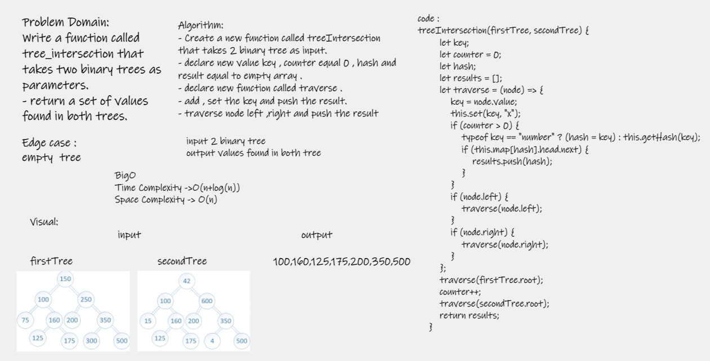

# Challenge Summary
- Write a function called tree_intersection that takes two binary trees as parameters.
- return a set of values found in both trees.

## Whiteboard Process

## Approach & Efficiency
- Time Complexity : o(n)
- Space Complexity : O(n)

## Solution

- Arguments: two binary tree
- Return: a set of values found in both trees
- npm test tree-intersection.test. .

